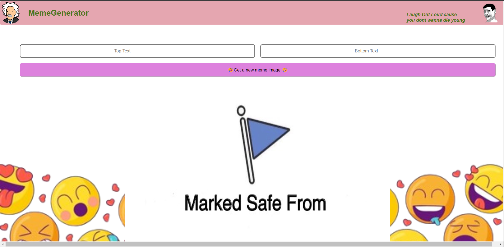

# MemeMagic

Welcome to the **MemeMagic!** This application allows users to randomly generate memes using an API and customize them by adding top and bottom text. The project is built using HTML, CSS, JavaScript, ReactJS, and NodeJS.

#### Features
 xcv,mnbmndvkjadsb

Randomly generates memes using an API
Allows users to add custom top and bottom text to the memes
Built with a modern tech stack including ReactJS for the frontend and NodeJS for the backend
Responsive design for seamless usage on various devices

#### Demo

Check out the video demonstration to see the Meme Generator in action!

## Video Demonstration

#### Installation

Clone the repository:
`git clone https://github.com/callistox9/MagicMeme.git`
Install the dependencies:

`
npm install`

Start the development server:
`
npm run dev`
Usage
Open your browser and navigate to ` http://localhost:3000`
Click the "Generate Meme" button to get a random meme from the API
Enter your desired top and bottom text in the input fields
Enjoy your custom meme!

#### Technologies Used

**HTML**: For the structure of the web pages
**CSS**: For styling the application
**JavaScript**: For the logic and interactivity
**ReactJS**: For building the user interface
**NodeJS**: For the backend server and API interactions

#### Contributing

Fork the repository
Create a new branch (git checkout -b feature-branch)
Make your changes
Commit your changes (git commit -m 'Add some feature')
Push to the branch (git push origin feature-branch)
Open a pull request
